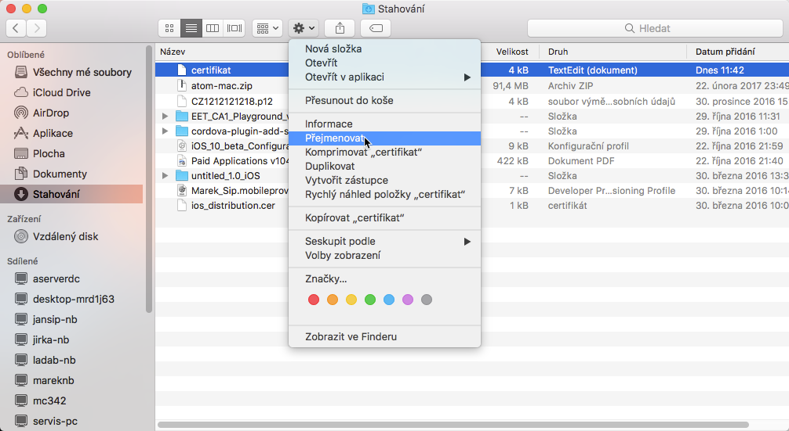
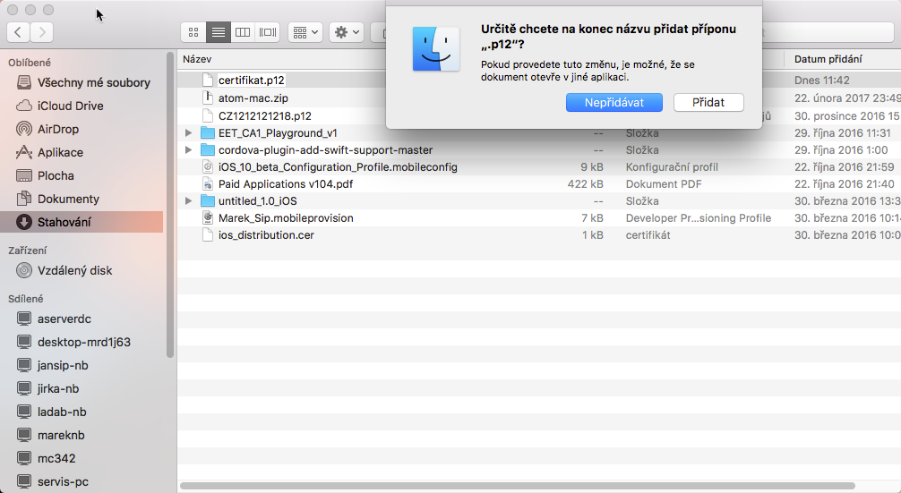

# Apple iOS - EET Certifikát

Certifikát je zapotřebí vygenerovat na PC nebo na mac OS, ne na iPhone nebo iPad.

Pokud vytváříte certifikát v prohlížeči **Safari**, nastane problém se stažením neznámého souboru "Unknown", bude zapotřebí po stažení certifikátu přejít do **Stahování **- \(vybrat soubor\) ozubeným kolem **Přejmenovat **na "**certifikat.p12**" a potvrdit **Přidat**.

## Přejmenování \(pouze Safari\) 

## Potvrzení \(pouze Safari\)

