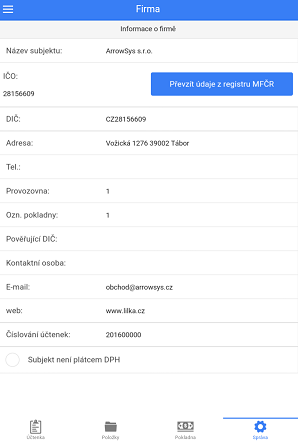

# Identifikace firmy

V záložce **Správa &gt; Informace o firmě** vyplňte údaje subjektu, které jsou potřeba pro identifikaci firmy na účtence.

Nejstručněji je potřeba vyplnit 3 položky:

1. **Název subjektu -** název provozovny/subjektu
2. **IČO -** identifikační číslo osoby.
3. **DIČ -** daňové identifikační číslo.
4. **Adresa -** adresa provozovny

Údaje lze také převzít z registru MFČR vyplněním IČO a následném stisknutí tlačítka **Převzít údaje z registru MFČR**.

