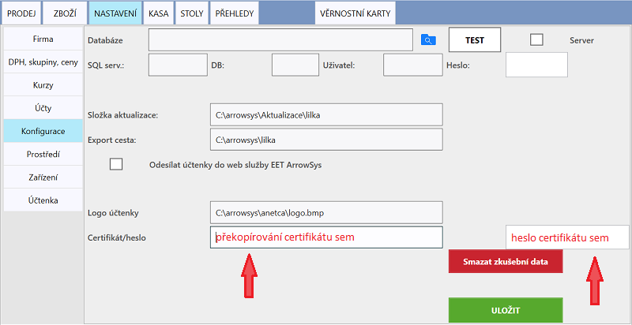
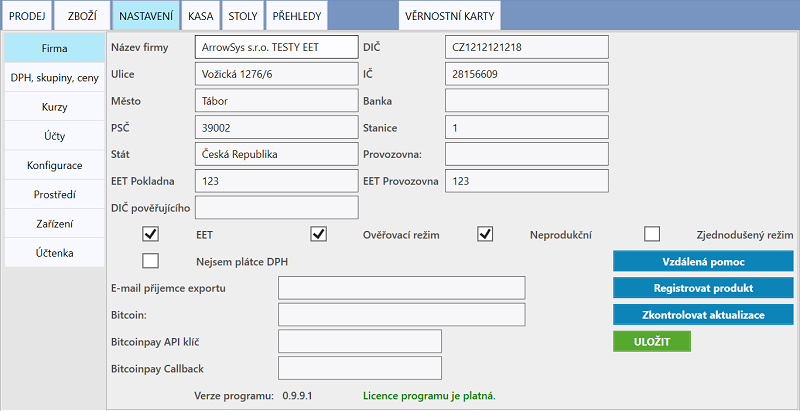

# Nastavení elektronické evidence tržeb

Před vyplněním údajů odesílaných do EET je zapotřebí získat Digitální certifikát. Návod naleznete na serveru [e-trzby.cz](http://www.etrzby.cz/cs/webova-aplikace-EET-a-certifikaty). Soubor certifikátu je zapotřebí překopírovat přímo do zařízení, připojením přes USB.

### Aktivace funkce odesílání do systému EET

1. Přesuneme se do **NASTAVENÍ > Konfigurace**, kde je potřeba vyplnit:
   
   - **Certifikát** - Do této kolonky překopírujete vám přidělený digitální certifikát
   - **heslo** - Heslo, které bylo zadáno při vytvoření certifikátu na [Webové aplikaci EET](http://adisspr.mfcr.cz/adistc/adis/idpr_pub/eet/eet_sluzby.faces)
   - Nastavení uložíte kliknutím na tlačítko **Uložit**. 
   

   
2. Následně je zapotřebí v **NASTAVENÍ > Firma** vyplnit:

   - **DIČ** - musí obsahovat předponu CZ, napři CZ1212121218
   - **EET Provozovna** (většinou 123) maximálně 999999
   - **EET Pokladna** (libovolné, může obshovat max 20 alfanumerických znaky např. POKLADNA1)
   - V případě Komisního (Zástupného) prodeje je nutné vyplnit **Pověřující DIČ**.
   - Pokud má provozovna od Finančního úřadu schválenou možnost evidence ve zjednodušeném režimu, zvolte možnost **Zjednodušený režim**.
   - Nastavení uložíte kliknutím na tlačítko **Uložit**. 
   - Po vyplnění požadovaných údajů, aktivujte odesílání do EET zvolením **EET Odesílání**. 
   - Pro kontrolu nastavení a správnosti odesílaných dat můžete zvolit možnost **Ověřovací režim**. Při pořízení účtenky v OR bude     
     provedena kontrola odesílaných údajů. Odesílaná účtenka nebude evidována, nýbdrž zkontrolována. Při správném nastavení by měl server 
     EET vrátit odpověď "*0 Datovou zpravu evidovane trzby v overovacim modu se podarilo zpracovat*"
   - Nastavení uložíte kliknutím na tlačítko **Uložit**. 

