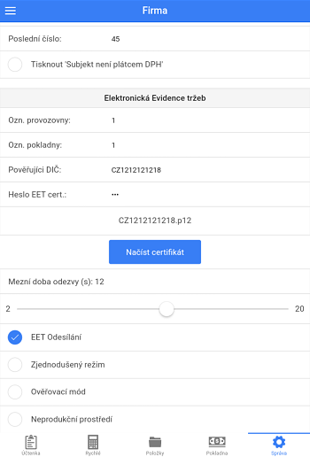

# Nastavení elektronické evidence tržeb

Nastavení probíhá v záložce **Správa > Informace o firmě**. 
 
Před vyplněním údajů odesílaných do EET je zapotřebí získat Digitální certifikát. Návod naleznete na serveru [e-trzby.cz](http://www.etrzby.cz/cs/webova-aplikace-EET-a-certifikaty). Soubor certifikátu je zapotřebí překopírovat přímo do zařízení, připojením přes USB.
  
Pro aktivaci funkce odesílání do systému EET je nutné vyplnit:
 
- **DIČ** - musí obsahovat předponu CZ, napři CZ1212121218. **Platí i pro neplátce DPH.**
- **Číslo Provozovny** - (většinou 11 nebo 21) maximálně 999999
- Označení Pokladny - (libovolné, může obsahovat max 20 alfanumerických znaků např. POKLADNA1)
- **Heslo certifikátu** - Heslo, které jste si zadali při vytváření certifikátu jako heslo pro "soukromý klíč" do [Webové aplikace EET](http://adisspr.mfcr.cz/adistc/adis/idpr_pub/eet/eet_sluzby.faces)
- Po vyplnění hesla se zobrazí možnost **Nahrát certifikát**. Po kliknutí na tlačítko **Nahrát certifikát** vyberte možnost vašeho cloud úložiště (pokud cloud účet nemáte vytvořený, prosím vytvořte jej. Následně do něj nahrajte váš EET certifikát). Certifikát zvolte ze složky, do které byl nakopírován. 

*Cloud pro Apple: [iCloud drive](https://www.icloud.com/)*

*Cloud pro Windows: [One drive](https://onedrive.live.com/)*

*Cloud pro Android: [Disk google](https://www.google.cz/intl/cs/drive/)*

V případě Komisního (Zástupného) prodeje je nutné vyplnit Pověřující DIČ. 

Pokud má provozovna od Finančního úřadu schválenou možnost evidence ve zjednodušeném režimu, zvolte možnost **Zjednodušený režim**.     

Po vyplnění požadovaných údajů, aktivujte odesílání do EET zvolením **EET Odesílání**. 

Pro kontrolu nastavení a správnosti odesílaných dat můžete zvolit možnost **Ověřovací režim**. Při pořízení účtenky v OR bude provedena kontrola odesílaných údajů. Odesílaná účtenka nebude evidována, nýbrž zkontrolována. Při správném nastavení by měl server EET vrátit odpověď "*0 Datovou zpravu evidovane trzby v overovacim modu se podarilo zpracovat*"
 
 

**Neprodukční prostředí**
- Do neprodukčního prostředí lze odesílat pouze s [Playground certifikáty](http://www.etrzby.cz/assets/cs/prilohy/EET_CA1_Playground_v1.zip). Podmínkou je mít vyplněné DIČ a zvolenou volbu **Neprodukční prostředí**
