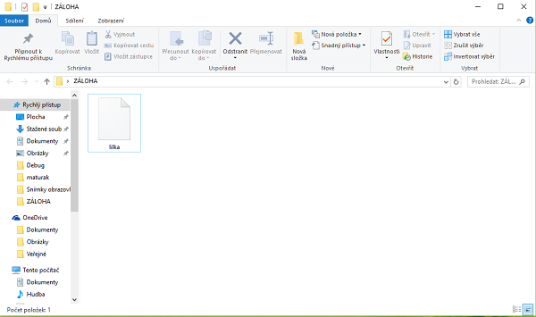

# Záloha a obnova dat

Zálohu dat je možné provést v záložce **Správa &gt; Správa dat**.

* Po kliknutí na tlačítko **Zálohovat** se zobrazí seznam dostupných možností zálohování
* Také se vytvoří v zařízení slozka LILKA-data s podsložkou BACKUP

**LILKA-data/lilka** - složka pro obnovu. Do této složky nutné překopírovat zálohu, kterou potřebujete obnovit. Soubor musí být bez přípony "lilka".

**LILKA-data/BACKUP** - záloha, která se vytvoří pokud stisknete tlačítko **"ZÁLOHOVAT"**. Z této složky lze aktuálně vykopírovat zálohu, případně ji pomocí tlačítka **"ZÁLOHOVAT"** poslat na email nebo přes jiný informační kanál.

**\*POZOR:** po smazání zkušebních dat může na některých zařízeních dojít ke smazání této složky, Poté je nutné ji v zařízení ručně vytvořit.

### Záloha na počítači či tabletu s Windows 10

1. Přejděte do "C:\Users\_\_uživatel\_\_\AppData\Local\Packages\48856mareksip.DEMOLILKApokladnaEET\_x3wt2hez9zpqe\LocalState\".
2. Zde překopírujte soubor "lilka" do složky, kde bude umístěna záloha.
3. Soubor uchovejte pro případnou obnovu na bezpečném místě, kde nehrozí jeho ztráta.

#### Obnova ze zálohy Windows 10

1. Z emailu stáhněte přílohu do počítače.
2. Překopírujte stažený soubor do: "C:\Users\_\_uživatel\_\_\AppData\Local\Packages\48856mareksip.DEMOLILKApokladnaEET\_x3wt2hez9zpqe\LocalState\".
3. Pokud je již ve složce takovýto soubor, nahraďte jej.
4. Spusťte pokladnu LILKA.

\***\*uživatel\*** značí aktuálně přihlášeného uživatele PC

**\*\***je nutné mít zapnutou funkci** ZOBRAZIT SKRYTÉ SOUBORY** v systému Windows

### Záloha na zařízeních APPLE

1. Spusťte LILKU na Vašem iPad nebo iPhone.
2. Přejděte do záložky **"SPRÁVA-&gt;SPRÁVA DAT"**.
3. Stiskněte tlačítko **"ZÁLOHOVAT"**.
4. Do kolonky KOMU vyplňte email příjemce zálohy\(nejčasteji Vaši adresu na iCloud\).

#### Obnova ze zálohy APPLE

1. Z emailu kam byla záloha poslána uložte přiložený soubor přímo na iCloud.
2. Přejmenujte soubor **"LILKA"** na **"LILKA.TXT"**.
3. Spusťte pokladnu LILKA a přejděte do záložky **"SPRÁVA-&gt;SPRÁVA DAT"**.
4. Stiskněte tlačítko **"OBNOVIT"**.
5. Vyberte položku iCloud drive a vyberte **"LILKA.TXT"**.
6. Ve spodní části obrazovky by se mělo objevit hláška **"DATA BYLA OBNOVENA. RESTARTUJTE APLIKACI".**
7. Restartujte pokladnu LILKA.

### Záloha na zařízeních Android

#### Záloha přes Bluetooth

1. Spárujte zařízení, na které má být odeslána záloha dat, se zařízením, ve kterém je aplikace LILKA.
2. Při zálohování zvolte možnost **"Bluetooth".**
3. V seznamu spárovaných zařízení vyberte příslušné zařízení a data se začnou odesílat.

#### Záloha přes E-mail

1. Při zálohování zvolte možnost **"E-mail"** nebo **"Gmail".**
2. Přidejte Váš e-mail do e-mailové aplikace \(aplikace, která se otevře po vybrání zálohy e-mailem\) - program vám sám tuto možnost nabídne.
3. Vyplňte příjemce \(e-mail, na který bude záloha dat odeslána\).
4. Odešlete.

U operačních systému Windows 10 desktop se bude e-mail otevírat, pouze pokud je výchozí poštovní klient aplikace [**Pošta**](https://www.microsoft.com/en-us/store/p/mail-and-calendar/9wzdncrfhvqm) \(LILKA není kompatibilní s programem Outlook\).

              

**Jako záloha se vytvoří 1 soubor \(viz obrázek níže\), který obsahuje všechny potřebné soubory**

#### Obnova ze zálohy Android

1. Soubor se zálohou překopírujte do složky **"LILKA-data"** v zařízení.
2. Přejmenujte jej tak, aby neměl žádnou příponu. Musí se jmenovat pouze **"lilka"**.
3. Spusťte LILKU.
4. Přejděte do záložky **"SPRÁVA-&gt;SPRÁVA DAT"**.
5. Stiskněte **"OBNOVIT"**.

