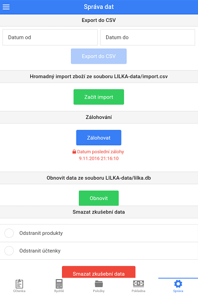
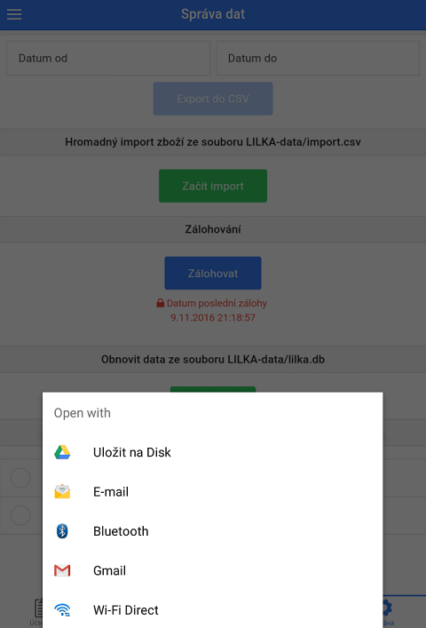

# Záloha dat

Zálohu dat je možné provést v záložce **Správa > Správa dat**.

- Po kliknutí na tlačítko **Zálohovat** se zobrazí seznam dostupných možností zálohování
 
                 
   
### Záloha přes Bluetooth

1. Spárujte zářízení, na které má být odeslána záloha dat, se zařízením, ve kterém je aplikace LILKA
2. Při zálohování zvolte možnost **Bluetooth**
3. V seznamu spárovaných zařízení vyberte příslušné zařízení a data se začnou odesílat

### Záloha přes E-mail

1. Při zálohování zvolte možnost **E-mail** nebo **Gmail**
2. Přidejte Váš e-mail do e-mailové aplikace (aplikace, která se otevře po vybrání zálohy e-mailem) - program vám sám tuto možnost nabídne.
3. Vyplňte příjemce (e-mail, na který bude záloha dat odeslána)
4. Odešlete

- U operačních systému Windows 10 desktop se bude e-mail otevírat, pouze pokud je výchozí poštovní klient aplikace Pošta (LILKA není kompatibilní s programem Outlook).

