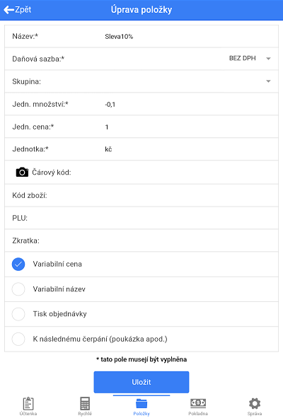
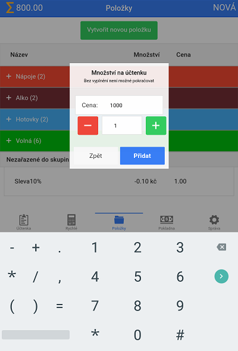
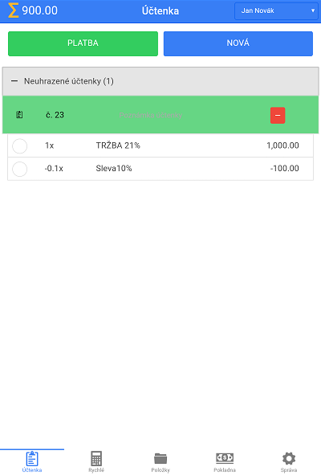

# Sleva

### Vytvoření slevové položky

Pro lepší přehlednost je dobré pojmenovat slevovou položku jako "Sleva" a procentuální velikost slevy. Např. "Sleva 20%" nebo "Sleva 15%".
Při založení slevové položky je nutné, zvolit daňovou sazbu "BEZ DPH", zapsat do kolonky **Jedn. cena** "1" a jako jednotku zvolit výchozí měnu (kč). Do kolonky **Jedn. množství** napiště znaménko "-" a procentuální velikost slevy / 100 (tzn. pokud chcete vytvořit slevu 20%, napiště -0,2, pokud slevu 15%, tak -0,15). Níže prosím povolte **Variabilní cena**. Potvrďte stiskem tlačítka **Uložit**.

### Použití slevové položky

Po označení účtenky, na které chcete slevu aplikovat a kliknutí na položku slevy zadejte do kolonky **Cena:** velikost částky, ze které chcete slevit a klikněte na tlačítko **Přidat**.

