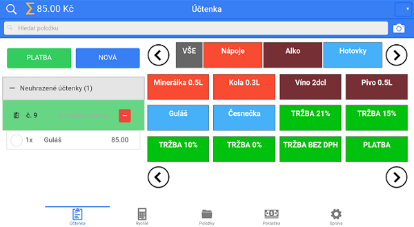

# Vyhledávání

Pro vyhledávání položek v sekci **Účtenka** slouží ikona lupy zobrazující se v levém horním rohu. Po kliknutí na ikonu se vykreslí řádek, do kterého zadejte název nebo počáteční písmena hledané položky. Položku lze také načíst přes čtečku čárového kódu, kliknutím na ikonu fotoaparátu.

