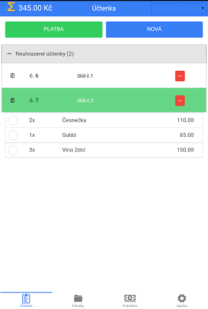

# První účtenka

### Založení dokladu
V záložce **Účtenky** založíte novou účtenku kliknutím na velké modré tlačítko **NOVÁ**. V zápětí bude vytvořen nový řádek, označený zeleně, to je barva která indikuje aktuálně vybranou účtenku. Účtenky s bílým pozadím jsou ty, se kterými nyní nepracujete.

    

         
    

### Nyní přidejte produkty

Jakmile budete mít vybranou účtenku a evidované první produkty, v záložce **Produkty** klikněte na řádek produktu který budete chtít přidat na účtenku. Zobrazí se okno pro doplnění **Množství na účtenku**. V případě **chybného vložení produktu na účtenku** přidržte příslušný řádek prstem po 2 vteřiny a objeví se potvrzení volby o odstranění.

    

         
    

Pokud se zařízením pracujete ve svislém módu (na šířku), můžete produkty načítat na účtenku z nabídky produktů, která se zobrazuje vedle seznamu účtenek (vpravo).

### Ukončete účtenku

Až budou všechny položky přidány, přejděte zpět do kategorie **Účtenka** a přes velké zelené tlačítko **PLATBA** přejděte k úhradě. V novém okně libovolně vyberte způsob platby, informace o hotovosti a pokud jsou žádoucí, tak údaje pro KH.

### Účtenku na email nebo tisknout?

Před pořízením další účtenky si v **Nastavení** vyberte zdali zákazníkovi budete účtenky tisknout po bluetooth tiskárně

-  vyžaduje mít vyplnění *Název tiskárny* v **Správa > Nastavení**
a nebo e-mailem
- to bude potřeba zapnout *Povolit odesílání účtenek na e-mail* v **Správa > Nastavení**

