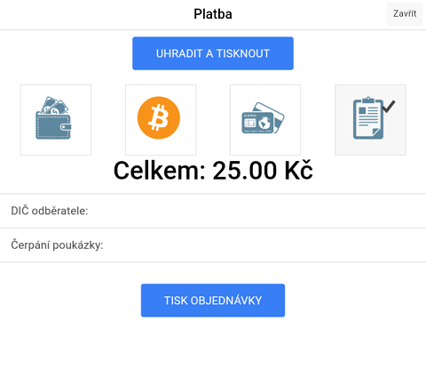
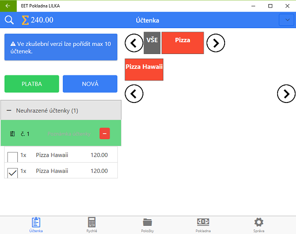
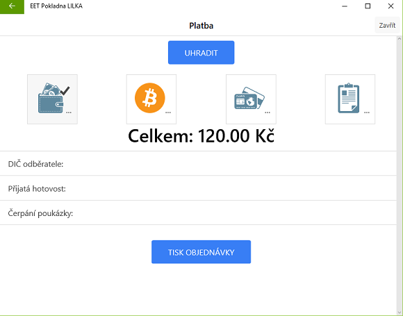

# Platba

### Hotovost

### Platba Bitcoinem

* Před použiváním vyplňte Bitcoin adresu nebo BIP44 veřejný klíč, nebo připojení BitcoinPay účet.

### Platba kartouZ

1. Jedná se o platbu platební kartou kdy ve způsobu úhrady na účtence se zobrazí text** ZPŮSOB ÚHRADY: KARTOU.**

### Platba fakturou

Při úhradě účtenky fakturou, účtenka není odeslána do EET.

1. Po stisknutí tlačítka **PLATBA** na hlavní účtovací obrazovce vyberte poslední možnost představující uhrazení účtenky fakturou

   

2. Stisknutím tlačítka **UHRADIT A TISKNOUT** se vytiskne faktura

#### Přehled vystavených faktur

1. Otevřete **Správa &gt; Přehledy tržeb**
2. Stiskněte tlačítko **ZOBRAZIT** v sekci **Přehled tržeb podle způsobu platby**

## Částečná platba

Vybráním \(zaškrtnutím\) položek účtenky dojde k vytvoření nové účtenky pouze s označenými položkami. Poté stiskněte Platba.

