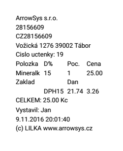

# Faktura

### Platba fakturou

1. Po stisknutí tlačítka **PLATBA** na hlavní účtovací obrazovce vyberte poslední možnost představující uhrazení účtenky fakturou
   
   

2. Stisknutím tlačítka **UHRADIT A TISKNOUT** se vytiskne faktura

   

*Při úhradě účtenky fakturou, účtenka není odeslána do EET.*

### Přehled vystavených faktur

1. Otevřete **Správa > Přehledy tržeb**
2. Stiskněte tlačítko **ZOBRAZIT** v sekci **Přehled tržeb podle způsobu platby**

