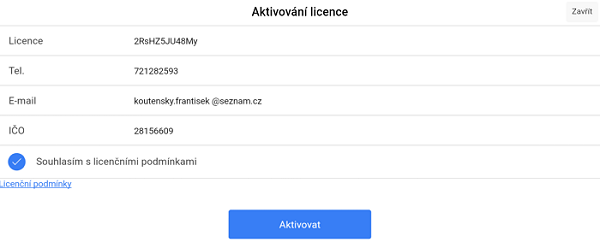

# Aktivování licence

Plná verze programu se aktivuje otevření záložky **Podpora**, která se nachází v hlavní nabídce **Správy** (Přesunutí do hlavní nabídky proběhne po kliknutí na ikonku v levém horním rohu). Stisknutím tlačítka **Aktivování licence** se zobrazí formulář, kde je potřeba vyplnit licenční kód, tel. číslo, email a IČO. Aktivace může probíhat pár vteřin.

Nyní již není možné dělat cvičné účtenky bez toho, aniž byste je museli stornovat (účtenka se záporným množstvím).

Pokud byste chtěli znovu instalovat čistou verzi, je zapotřebí kontaktovat obchod@arrowsys.cz, abychom vám aktivaci zpřístupnili.
