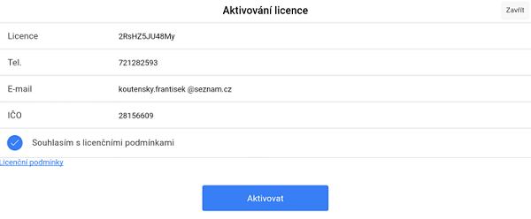

# Podpora

V podpoře je především možnost aktivovat licenci, spustit vzdálenou pomoc, případně zde lze vyčíst licenční číslo spolu s verzí programu.

### Aktivování licence

Plná verze programu se aktivuje otevřením záložky **Podpora**, která se nachází v **hlavní nabídce** záložky **Správa** \(Přesunutí do hlavní nabídky proběhne po kliknutí na ikonku v levém horním rohu\). Stisknutím tlačítka **Aktivovat licenci** se zobrazí formulář, kde je potřeba vyplnit licenční kód, tel. číslo, email a IČO.

_Tlačítko "Aktivovat licenci" není možné stisknout v případě, že na vašem zařízení již je aktualizovaná nejnovější verze programu LILKA_

Nutností je také souhlasit s licenčními podmínkami \(zaškrtnout poslední kolonku\).  
Aktivace může probíhat pár vteřin.

Nyní již není možné dělat cvičné účtenky bez toho, aniž byste je museli stornovat \(účtenka se záporným množstvím\).

Pokud byste chtěli znovu instalovat čistou verzi, je zapotřebí kontaktovat obchod@arrowsys.cz, abychom Vám aktivaci zpřístupnili.

### Vzdálená pomoc

# Vzdálená pomoc \(Android\)

1. Otevřete **Správa &gt; Podpora** a klikněte na tlačítko **Vzdálená pomoc**

   

2. Po zobrazení aplikace [**TeamViewer QuickSupport**](https://play.google.com/store/apps/details?id=com.teamviewer.quicksupport.market&hl=cs) v **Google Play** aplikaci TeamViewer QuickSupport nainstalujte kliknutím na tlačítko **INSTALOVAT**

   

   Pro plnou funkčnost aplikace prosím potvrďte instalaci potřebných doplňků

   

3. Po instalaci se otevře aplikace TeamViewer QuickSupport, kde bude vypsán Váš **ID kód**

   

4. Nyní kontaktujte zákaznickou podporu Arrowsys na čísle **381 251 685** a sdělte váš problém a **ID kód** Vašeho zařízení

5. Povolte připojení ke Vzdálené správě tlačítkem **Povolit**

   

