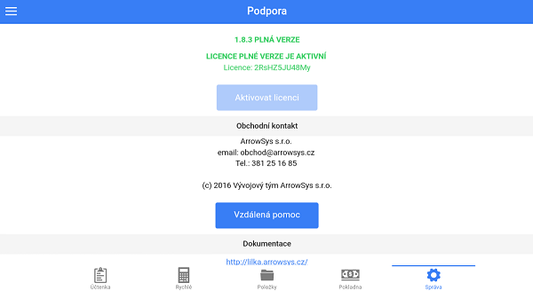

# Podpora

V podpoře je především možnost aktivovat licenci, spustit vzdálenou pomoc, případně zde lze vyčíst licenční číslo spolu s verzí programu.

### Aktivování licence

1. Spusťte EET pokladnu LILKA.
2. Přejděte do záložky **"SPRÁVA-&gt;PODPORA"**.
3. Stiskněte tlačítko **"AKTIVOVAT LICENCI"**.
4. Vyplňte **"ČÍSLO LICENCE, TELEFON, EMAIL a IČO"**.
5. Zaškrtněte pole **"SOUHLASÍM S LICENČNÍMI PODMÍNKAMI"**.
6. Potvrďte tlačítkem **"AKTIVOVAT"**.

\*tato akce může trvat i několik vteřin.

\*\*_Tlačítko "Aktivovat licenci" není možné stisknout v případě, že je na Vašem zařízení již licence aktivována._

Nyní již není možné dělat cvičné účtenky bez toho, aniž byste je museli stornovat \(účtenka se záporným množstvím\).

Pokud byste chtěli znovu instalovat čistou verzi, je zapotřebí kontaktovat nás na email eet@lilka.cz, abychom Vám zpřístupnili Vaši licenci.

### Vzdálená pomoc pro Android

1. Otevřete **Správa &gt; Podpora** a klikněte na tlačítko **Vzdálená pomoc**

   

2. Po zobrazení aplikace [**TeamViewer QuickSupport**](https://play.google.com/store/apps/details?id=com.teamviewer.quicksupport.market&hl=cs) v **Google Play** aplikaci TeamViewer QuickSupport nainstalujte kliknutím na tlačítko **INSTALOVAT**

   

   Pro plnou funkčnost aplikace prosím potvrďte instalaci potřebných doplňků

   

3. Po instalaci se otevře aplikace TeamViewer QuickSupport, kde bude vypsán Váš **ID kód**

   

4. Nyní kontaktujte zákaznickou podporu Arrowsys na čísle **381 251 685** a sdělte váš problém a **ID kód** Vašeho zařízení

5. Povolte připojení ke Vzdálené správě tlačítkem **Povolit**

   

### Manuální aktualizace databáze

1. Spusťte EET pokladnu LILKA.
2. Přejděte do záložky **"SPRÁVA"**.
3. V hlavní nabídce zvolte záložku **"PODPORA"**.
4. Stiskněte tlačítko **"AKTUALIZOVAT DATABÁZI"**.

