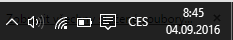
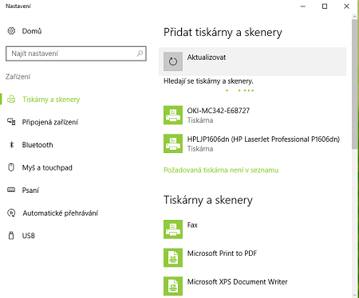
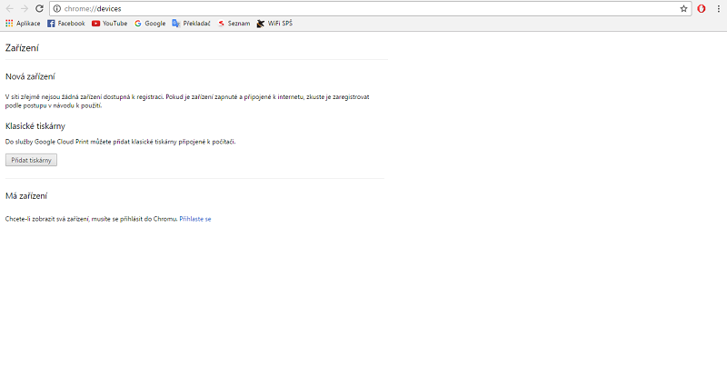
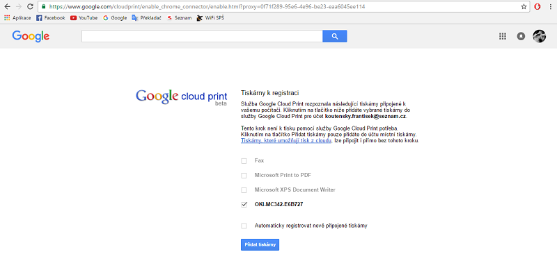
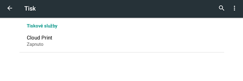
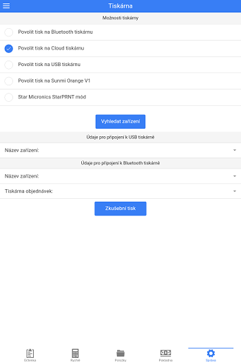

# Tiskárna

LILKA umožňuje podle typu operačního systému tisk přes rozhraní Bluetooth a USB. Tabulku podporovaných rozhraní naleznete níže.

|  | **USB** | **Bluetooth** | 
| -- |
| **Android** | ANO | ANO | 
| **Windows** | NE | ANO | 
| **iOS** | NE | ANO | 

## Spárování Bluetooth tiskárny

### Příprava
- Tiskárnu je nutné před používáním zbavit ochrané fólie na baterce. Odstraňte kryt a sejměte z baterie ochranou fólii, která brání kontaktům pro napájení.
-  Nabijte a zapněte tiskárnu, následně postupujte podle typu operačního systému, který používáte.

### Android
1. V *Nastavení* Vašeho zařízení přejděte do volby *Bluetooth*
2. V seznamu *Dostupná zařízení* vyberte Vaši Bluetooth tiskárnu a vyplňte párovací klíč, nejčastěji je tato hodnota 0000, 1234 nebo 123456 
3. Přejděte do *Pokladny LILKA*, záložky *Správa - Tiskárna* a název Bluetooth zařízení opište do pole *Název zařízení* v sekci *Údaje pro připojení k Bluetooth tiskárně*. Dbejte na správnost velkých a malých písmen.
4. Aktivujte Bluetooth tisk volbou **Povolit tisk na Bluetooth tiskárnu**
5. Stiskněte Zkušební tisk.

### Apple
1. Na **AppStore** nainstalujte aplikaci **"LIGHTBLUE"** 
2. Zapněte tiskárnu, zkontrolujte zda máte papír v tiskárně a **spusťte aplikaci LIGHTBLUE**
3. Vyhledejte tiskárnu v seznamu a klikněte na ni. 
4. Po spárování Vám vyskočí parametry tiskárny, kde v pravém horním rohu stiskněte **tlačítko "CLONE"**
5. Spusťte pokladnu LILKA a přejděte do záložky **"Správa->Tiskárna"**
6. Zaškrtněte tlačítko **"povolit tisk na Bluetooth tiskárnu"** a vyberte tiskárnu ze seznamu tiskáren. Seznam naleznete ve spodní části s nápisem **"Údaje pro připojení k Bluetooth tiskárně"**.
7. stiskněte **"zkušební tisk"**

### Windows 10 PC
1. Na hlavním panelu Windows přejděte do menu Centrum akcí 

    

         
    

2. Levým tlačítkem myši přidržte dlaždici Bluetooth a zvolte Přejít do nastavení. 
3. Aktivujte Bluetooth
4. V seznamu vyberte Vaši Bluetooth tiskárnu a vyplňte párovací klíč, nejčastěji je tato hodnota 0000, 1234 nebo 123456 
5. Přejděte do *Pokladny LILKA*, záložky *Správa - Tiskárna* a název Bluetooth zařízení opište do pole *Název zařízení* v sekci *Údaje pro připojení k Bluetooth tiskárně*. Dbejte na správnost velkých a malých písmen.
6. Aktivujte Bluetooth tisk volbou **Povolit tisk na Bluetooth tiskárnu**
7. Stiskněte Zkušební tisk.

### Windows 10 Mobile
1. Přejděte do Nastavení - Zařízení - Bluetooth.
2. Zkontrolujte zdali Stav Bluetooth je Zapnuto.
3. V seznamu vyberte vaši Bluetooth tiskárnu a vyplňte párovací klíč, nejčastěji je tato hodnota 0000, 1234 nebo 123456 
4. Přejděte do *Pokladny LILKA*, záložky *Správa - Tiskárna* a název Bluetooth zařízení opište do pole *Název zařízení* v sekci *Údaje pro připojení k Bluetooth tiskárně*. Dbejte na správnost velkých a malých písmen.
5. Aktivujte Bluetooth tisk volbou **Povolit tisk na Bluetooth tiskárnu**
6. Stiskněte Zkušební tisk.

### Apple iOS
1. Přejděte do *Pokladny LILKA*, záložky *Správa - Tiskárna*, v sekci *Údaje pro připojení k Bluetooth tiskárně vyberte z nabídky *Název zařízení* nabízenou tiskárnu *. Pokud se žádné zařízení v seznamnu nezobrazuje, stiskněte zlačítko **Vyhledat zařízení**.
2. Aktivujte Bluetooth tisk volbou **Povolit tisk na Bluetooth tiskárnu**
3. Stiskněte Zkušební tisk.

### Star Micronics
Pokud má tisk na tiskárnách Star Micronics špatný formát, pravědpodobně tiskárna podporuje pouze StarPRNT tiskový režim, aktivujte jej v nastavení LILKA - *Správa - Tiskárna - Star Micronics StarPRNT mód*.

## Spárování USB tiskárny
### Android
1. Přejděte do záložky* Správa - Tiskárna* 
2. Aktivujte USB tisk volbou *Povolit tisk na USB tiskárnu*.
3. Stiskněte tlačítko *Vyhledat USB zařízení*.
4. Pokud budete upozorněni, že byla nalezena USB zařízení ve výběrovém poli *Název zařízení* vyberte tiskárnu. V opačném případě připojené zařízení nepodporuje USB tisk, nebo je zařízení špatně připojeno.
5. Stiskněte *Zkušební tisk*

## Google cloud print
### Android

#### Co je potřeba při google cloud print tisku:

1. Tiskárnu podporující Google Cloud print, nebo počítač s nejnovější verzí prohlížeče **[Google Chrome](https://www.google.com/chrome/browser/desktop/index.html)** a tiskárnu
2. Google účet (účet, na kterém jste přihlášeni ve Vašem zařízení s Android)

#### Pokud nemáte tiskárnu podporující Google Cloud print, je zapotřebí přidat tiskárnu do google účtu:
*V případě, že vaše tiskárna podporuje Google Cloud print, tento krok ignorujte*

1. Nejprve přidejte tiskárnu do počítače

   

2. Otevřete Google Chrome
3. V Google Chrome otevřete chrome://devices

   

4. Stiskněte tlačítko "Přidat tiskárny"
5. Vyhledejte Vaši tiskárnu
   
   

#### Nastavte google cloud tisk v zařízení s aplikací LILKA

1. Otevřete "Nastavení > Tisk"
2. Povolte Cloud print

   

#### Povolte Cloud tisk v aplikaci LILKA

1. Otevřete program LILKA
2. V záložce "Správa > Tiskárna" povolte "Tisk na Cloud tiskárnu"
   
   
