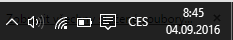

# Tiskárna

LILKA umožňuje podle typu zařízení tisk přes Bluetooth a USB rozhraní. Tabulku podporovaných rozhraní naleznete níže.

|  | USB | Bluetooth | 
| -- |
| **Android** | ANO | ANO | 
| **Windows** | NE | ANO | 
| **iOS** | NE | ANO | 

## Spárování Bluetooth tiskárny

###Android
1. V *Nastavení* vašeho zařízení přejděte do volby *Bluetooth*
2. V seznamu *Dostupná zařízení* vyberte vaši Bluetooth tiskárnu a vyplňte párovací klíč, nejčastěji je tato hodnota 0000, 1234 nebo 123456 
3. Přejděte do *Pokladny LILKA*, záložky *Správa - Tiskárna* a název Bluetooth zařízení opište do pole *Název zařízení* v sekci *Údaje pro připojení k Bluetooth tiskárně*. Dbejte na správnost velkých a malých písmen.
4. Stiskněte Zkušební tisk.
###Windows 10 PC
1. Na hlavním panelu Windows přejděte do menu Centrum akcí 

    

         
    

2. Levým tlačítkem myši přidržte dlaždici Bluetooth a zvolte Přejít do nastavení. 
3. Aktivujte Bluetooth
4. V seznamu vyberte vaši Bluetooth tiskárnu a vyplňte párovací klíč, nejčastěji je tato hodnota 0000, 1234 nebo 123456 
5. Přejděte do *Pokladny LILKA*, záložky *Správa - Tiskárna* a název Bluetooth zařízení opište do pole *Název zařízení* v sekci *Údaje pro připojení k Bluetooth tiskárně*. Dbejte na správnost velkých a malých písmen.
6. Stiskněte Zkušební tisk.
###Windows 10 Mobile
###iOS

### Star Micronics
Pokud má tisk na tiskárnách Star Micronics špatný formát, pravědpodobně tiskárna podporuje pouze StarPRNT tiskový režim, aktivujte jej v nastavení LILKA - *Správa - Tiskárna - Star Micronics StarPRNT mód*.