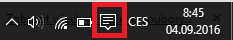

# Tiskárna

LILKA umožňuje podle typu operačního systému tisk přes rozhraní Bluetooth a USB. Tabulku podporovaných rozhraní naleznete níže.

|  | **USB** | **Bluetooth** | 
| -- |
| **Android** | ANO | ANO | 
| **Windows** | NE | ANO | 
| **iOS** | NE | ANO | 

## Spárování Bluetooth tiskárny

### Android
1. V *Nastavení* Vašeho zařízení přejděte do volby *Bluetooth*
2. V seznamu *Dostupná zařízení* vyberte Vaši Bluetooth tiskárnu a vyplňte párovací klíč, nejčastěji je tato hodnota 0000, 1234 nebo 123456 
3. Přejděte do *Pokladny LILKA*, záložky *Správa - Tiskárna* a název Bluetooth zařízení opište do pole *Název zařízení* v sekci *Údaje pro připojení k Bluetooth tiskárně*. Dbejte na správnost velkých a malých písmen.
4. Aktivujte Bluetooth tisk volbou **Povolit tisk na Bluetooth tiskárnu**
5. Stiskněte Zkušební tisk.

### Windows 10 PC
1. Na hlavním panelu Windows přejděte do menu Centrum akcí 

    

         
    

2. Levým tlačítkem myši přidržte dlaždici Bluetooth a zvolte Přejít do nastavení. 
3. Aktivujte Bluetooth
4. V seznamu vyberte Vaši Bluetooth tiskárnu a vyplňte párovací klíč, nejčastěji je tato hodnota 0000, 1234 nebo 123456 
5. Přejděte do *Pokladny LILKA*, záložky *Správa - Tiskárna* a název Bluetooth zařízení opište do pole *Název zařízení* v sekci *Údaje pro připojení k Bluetooth tiskárně*. Dbejte na správnost velkých a malých písmen.
6. Aktivujte Bluetooth tisk volbou **Povolit tisk na Bluetooth tiskárnu**
7. Stiskněte Zkušební tisk.

### Windows 10 Mobile
1. Přejděte do Nastavení - Zařízení - Bluetooth.
2. Zkontrolujte zdali Stav Bluetooth je Zapnuto.
3. V seznamu vyberte vaši Bluetooth tiskárnu a vyplňte párovací klíč, nejčastěji je tato hodnota 0000, 1234 nebo 123456 
4. Přejděte do *Pokladny LILKA*, záložky *Správa - Tiskárna* a název Bluetooth zařízení opište do pole *Název zařízení* v sekci *Údaje pro připojení k Bluetooth tiskárně*. Dbejte na správnost velkých a malých písmen.
5. Aktivujte Bluetooth tisk volbou **Povolit tisk na Bluetooth tiskárnu**
6. Stiskněte Zkušební tisk.

### iOS
1. Přejděte do *Pokladny LILKA*, záložky *Správa - Tiskárna* a název Bluetooth vyberte z pole *Název zařízení* v sekci *Údaje pro připojení k Bluetooth tiskárně*. Pokud se žádné zařízení v seznamnu nezobrazuje, stiskněte zlačítko **Vyhledat zařízení**.
2. Aktivujte Bluetooth tisk volbou **Povolit tisk na Bluetooth tiskárnu**
3. Stiskněte Zkušební tisk.
### Star Micronics
Pokud má tisk na tiskárnách Star Micronics špatný formát, pravědpodobně tiskárna podporuje pouze StarPRNT tiskový režim, aktivujte jej v nastavení LILKA - *Správa - Tiskárna - Star Micronics StarPRNT mód*.

## Spárování USB tiskárny
### Android
1. Přejděte do záložky* Správa - Tiskárna* 
2. Aktivujte USB tisk volbou *Povolit tisk na USB tiskárnu*.
3. Stiskněte tlačítko *Vyhledat USB zařízení*.
4. Pokud budete upozorněni, že byla nalezena USB zařízení ve výběrovém poli *Název zařízení* vyberte tiskárnu. V opačném případě připojené zařízení nepodporuje USB tisk, nebo je zařízení špatně připojeno.
5. Stiskněte *Zkušební tisk*