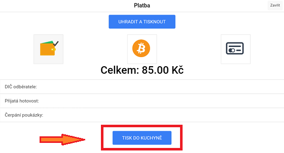

# Jak tisknout objednávku do kuchyně

### Připojení tiskárny kuchyně

1. Spárujte tiskárnu kuchyně se zařízením, na kterém je nainstalován program LILKA podle tohoto návodu -                                      https://lilka.arrowsys.cz/printer.html
2. Otevřete **Správa > Tiskárna**
3. Vyberte název tiskárny v kolonce **Tiskárna kuchyň**

### Tisk do kuchyně

1. Na hlavní účtovací obrazovce **Účtenka** označte účtenku, na které jsou položky, které chcete vytisknout do kuchyně
2. Stiskněte tlačítko **Platba**
3. Tisk potvrďte stisknutím tlačítka **TISK DO KUCHYNĚ**

