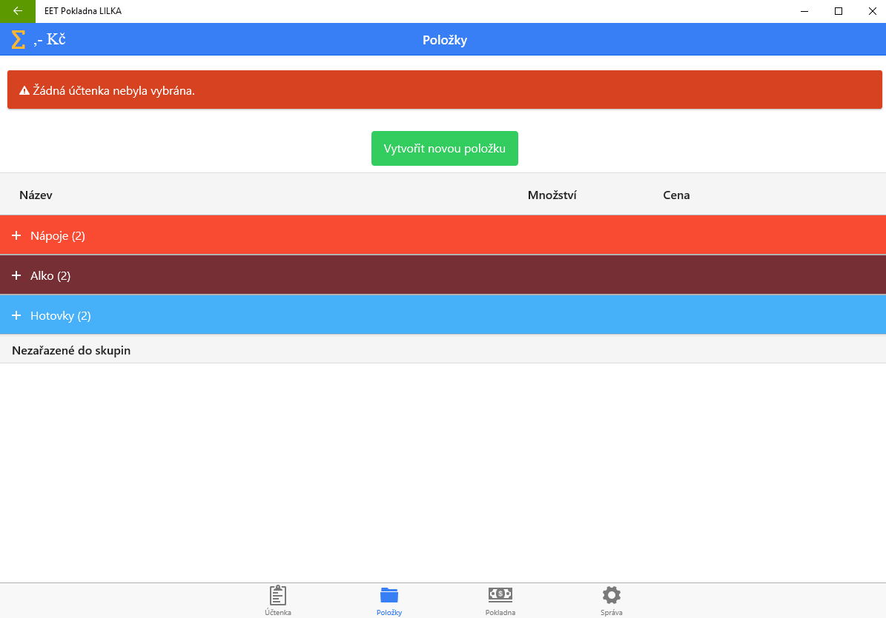
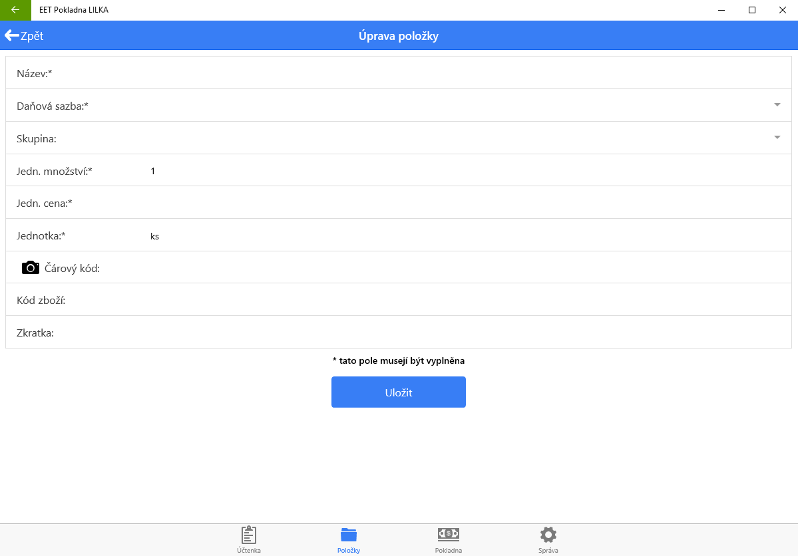

# Vytvořte produkty

Vlastní produkt zaevidujete v záložce **Položky** kliknutím na tlačítko **Vytvořit novou položku**. Po kliknutí bude otevřen nový formulář ve kterém je potřeba vyplnit nejméně:

1) Název

2) Daňovou sazbu

3) Jednotkové množství (většinou 1)

4) Jednotková cena

5) Jednotka - např kus, sada nebo balení

Produkty mohou být setříděny podle skupin, které lze zadat v záložce **Správa > Skupiny**. Pokud si nepřejete používat skupiny, produkty se budou řadit podle vložení do kategorie *Nezařazené*.

# POLOŽKY – ZÁKLADNÍ POŘÍZENÍ

Pro vytvoření nových položek kliknete na tlačítko zelené tlačítko **Vytvořit novou položku**.

**Název**

Do tohoto pole zadáte název zboží, pod kterým se pak bude zobrazovat na hlavní účtovací obrazovce.

**DPH**

Zde vyberete DPH dané prodávané položky. DPH nastavíte v Správa / Daňové sazby.

**Skupina**

Nastavíte skupinu, do které dané zboží připadá. Skupiny vytvoříte v Správa / Skupiny.

**Jedn. množství**

Množství udává počet jednotek. Zvolíte příslušnou jednotku z dodacího dokumentu.

**Jedn. cena**

Zadáte hodnotu bez jednotky. Cena musí být uvedena včetně případné DPH. 

**Jednotka**

Výchozí měnu (jednotku), ve které se bude hodnota ukládat, zvolíte v oddílu Správa / Nastavení.

**Čárový kód**

Čárovým kódem můžete hledat produkt na hlavní účtovací obrazovce. Po připojení čtečky čárových kódů se zboží vybere pomocí čtečky ČK.

**KÓD ZBOŽÍ**

Jedná se o spojovací číslo pro odpis ze zásob. Doporučuje se zadávat, i když zásoby ještě nepoužíváte. Např. Ve tvaru: 10000001, 1000002, 1000003, atd. Pokud prodáváte jen služby, není to zcela potřeba.

**Zkratka**

Pod zkratkou můžete hledat produkt na hlavní účtovací obrazovce. 
