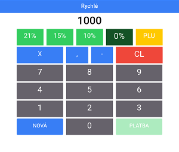
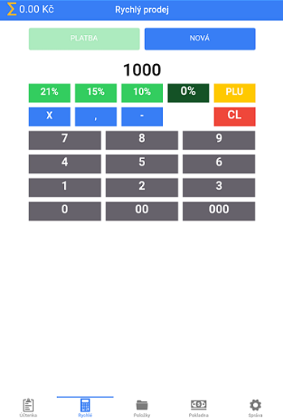
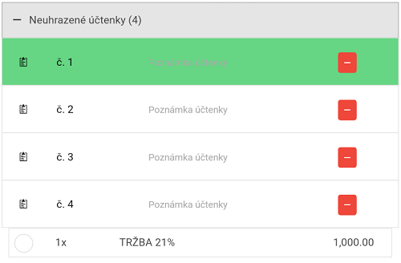

# Rychlé

Slouží k rychlému zadání tržby na účtenku.

### Zadaní tržby na účtenku

1. Označte účtenku, na kterou chcete tržbu přičíst na záložce **Účtenka**
2. Přesuňte se do záložky **Rychlé** 
3. Napiště částku tržby na kalkulačce
4. Stisknutím vybraného procenta DPH se převede tržba na označenou účtenku

Pokud chcete provést platbu, klikněte na tlačítko **PLATBA**, která platí pro celou označenou účtenku.

*obrázek: označená účtenka před provedením tržby*

*obrázek: zadání tržby v položce rychlé*

*obrázek: označená účtenka po provedením tržby*
