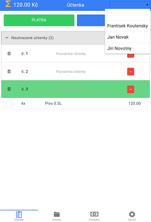
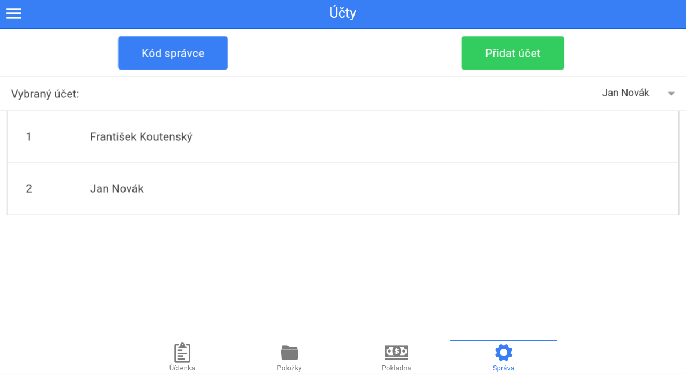
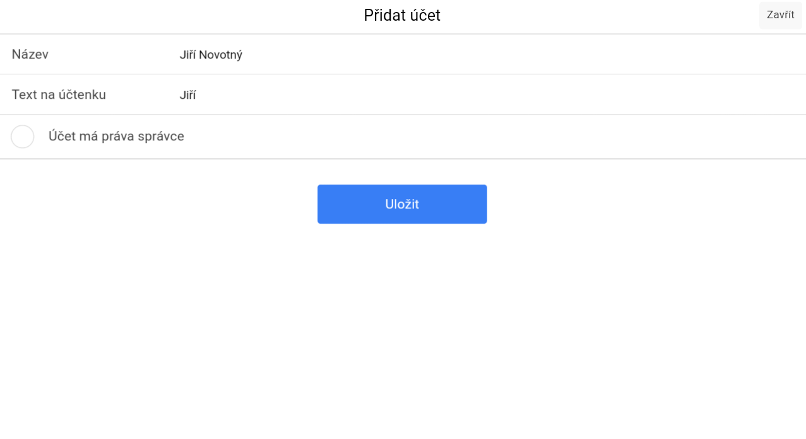

# Účty

V této záložce se nachází nástroje pro správu účtů a kódu správce \(heslo\). Účty se přepínají v pravém horním rohu záložky **Účtenka**. Výjimkou je účet správce, který se přihlašuje v záložce **Správa &gt; Účty**.

### Kód správce

Nastavení probíhá v **Správa &gt; Účty**.

Pokud je kód správce nastaven a je povolena možnost **Vyžadovat kód pro vstup do záložky Správa**, je pro vstup do správy vyžadováno zadání správného kódu správce. Při špatném zadání kódu se program vrátí do hlavní účtovací obrazovky.

Pro zrušení kódu správce je zapotřebí zadat stávající kód a stisknout tlačítko **ULOŽIT** \(**Správa &gt; Účty**\).

_Univerzální kód správce je: 8176_

### Založení účtu

Při vytváření účtu je potřeba vyplnit název účtu \(nejčastěji jméno a příjmení vlastníka účtu\). Text zapsaný do kolonky **Text na účtence** se bude zobrazovat jako jméno obsluhy na účtenkách vytvořených pod tímto účtem. Zaškrtnutím kroužku **Účet má práva správce** se účtu udělí všechna administrativní práva. V opačném případě bude účet ochuzen o vstup do záložky **Správa** \(pokud bude nastaven **Kód správce**\).

### Odstranění účtu

Odstranění bude provedeno po dvouvteřinovém přidržení prstu na vybraném účtu.

**Přidat účet**

