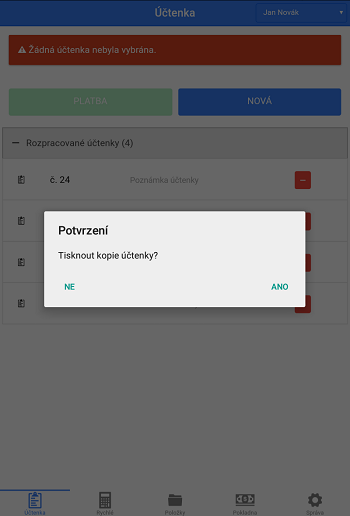

# Prostředí

* Ovládání:

  1. **Dotaz na množství po vybrání položky** - pokud je mód povolen, po každém přidání položky na účtenku se program dotáže na její množství. V opačném případě na účtenku vždy přidá položku pouze jednou.

  2. **Používat zvuková upozornění** - pokud je mód povolen, při každé platbě zazní zvuk otevření pokladny. V opačném případě nezazní.

  3. **Návrat od Rychlé po ukončení účtenky** - Pokud je mód povolen, při uhrazení a vytisknutí objednávky se znovu otevře položka "**Rychlé"**, v opačném připadě se otevře záložka "**Účtenka**"

  4. **Skrýt platbu fakturou **- Pokud je mód povolen, při zobrazení **PLATBA** se nezobrazí nabídka platby fakturou.

  5. **Výchozí způsob platby - hotovost** - Pokud je mód povolen, při stisknutí **PLATBA** v záložce **Účtenka **či** Rychlé** se automaticky zvolí platba hotovostí a přistoupí se k tisku účtenky.

* Účtenka:

  1. **Tisknout objednávky s ostatním zbožím** - pokud je mód povolen, na objednávku pro kuchyň se tiskne všechno zboží. V opačném případě                                                  se do kuchyně tiskne pouze zboží, které má povolenou možnost **Tisknout do kuchyně**                                                      \(Možnost Tisknout do kuchyně se volí při tvorbě položky, nebo při úpravě položky\).

  2. **Tisknout zkratku položky** - v případě povolení módu se na účtenku tiskne pouze zkratka položky \(např. hranolky - hran.\), místo celého názvu, který se tiskne, když mód není povolen.

  3. **Tisknout položku na nový řádek** - povolení módu způsobí, že pokud se celý název položky nevejde do své kolonky, její DPH, cena a množství se vytiskne pod tuto položku na nový řádek. V opačném případě nebude uvedeno celé jméno položky.

  4. **Netisknout jedn. cenu** - Pokud je mód aktivní, při tisku účtenky se pouze vytiskne celková cena druhu položky a její počet, cena za jednotlivé položky se nevytiskne

  5. **Tisknout jedn. cenu u korunových položek** - Pokud je mód aktivní, tiskne u položek s kódem zboží "999999" a Jedn. cenou 1,cennu za jednotku.

**Počet kopií** - číslo, kolikrát se bude tisknout kopie účtenky. Kopie účtenky se tisknou pouze v případě, že po dokončení platby tisk kopie povolíte a číslo v této kolonce je větší nebo rovno než 1.

_obrázek: Po ukončení účtenky se objeví dotaz na tisk kopie_

* Nastavení sestav:
  **Tržby - nevypisovat položky** -** **

