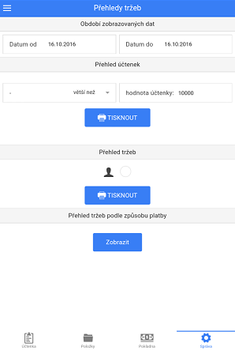
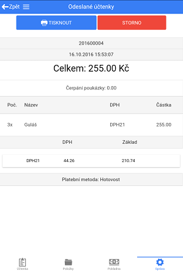

# Přehledy tržeb

Stisknutím tlačítka **TISKNOUT** v regionu **Přehled účtenek** LILKA vytiskne všechny účtenky provedené ve vybraném období a v zadaném intervalu hodnot (např. všechny účtenky v hodnotě větší než 100kč). Při tisknutí tržeb (region **Přehled tržeb**) lze zaškrtnutím ikonky s obličejem nechat vytisknout pouze účtenky, které byly provedeny pod aktuálně přihlášeným účtem. Tržby lze také zobrazit podle způsobu platby kliknutím na tlačítko **Zobrazit** v regionu **Přehled tržeb podle způsobu platby**.

### Odeslané účtenky

Seznam již vyřízených účtenek i s jejich podrobnostmi se nachází v záložce **Správa** > **Odeslané účtenky**. Zde je možnost **dodatečného vytisknutí účtenky** či stornování účtenky (kliknutím na tlačítko **STORNO** se vytvoří stejná účtenka, pouze se zápornými hodnotami)

