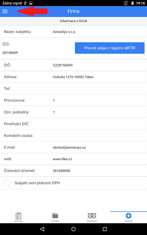

# Začínáme

Po spuštění programu bude automaticky nastaveno jazykové prostředí, odpovídající měna a doplněny dańové sazby.

## Základy ovládání
Ovládání aplikace je rozděleno do *čtyř* hlavních záložek vyskytujících se v zápatí obrazovky.

    

         
    

1) **Účtenka** zobrazuje aktuálně rozpracované doklady s příslušnými položkami,

2) **Produkty** slouží pro přidávání zboží na účtenku a pro správu vlastních produktů.

3) **Pokladna** zobrazuje aktuální zůstatek a pohyby pokladny.

4) V **Nastavení** naleznete přehledy, exporty, možnosti prostředí a správu kategorizačních položek jako Skupin a DPH.

Nastavení nabízí rozšířenou nabídku, do které lze vstoupit po kliknutí ikony se symbolem žebříku v levém horním rohu.

    

         
    

## Nastavení prostředí

### První jsou firemní údaje

Nejdůležitější je v Záložce **Nastavení** vyplnit údaje o firmě, které jsou potřeba pro iedntifikaci firmy na účtence. 

### Dále vytvořte produkty

Produkty mohou být setříděny podle **skupin**, které lze zadat v záložce **Nastavení > Skupiny**. Pokud si nepřejte používat skupiny, produkty se budou řadit podle vložení do kategorie **Nezařazené*.

