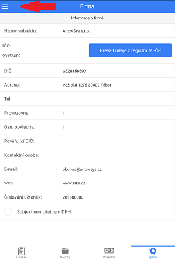

# Začínáme

Po spuštění programu bude automaticky nastaveno jazykové prostředí, odpovídající měna a doplněny dańové sazby.

## Základy ovládání
Ovládání aplikace je rozděleno do *čtyř* hlavních záložek vyskytujících se v zápatí obrazovky.

1) **Účtenka** zobrazuje aktuálně rozpracované doklady s příslušnými položkami.

2) **Produkty** slouží pro přidávání zboží na účtenku a pro správu vlastních produktů.

3) **Pokladna** zobrazuje aktuální zůstatek a pohyby pokladny.

4) **Správa** obsahuje přehledy, exporty, možnosti prostředí a správu kategorizačních položek jako Skupin a DPH.

Nastavení nabízí rozšířenou nabídku, do které lze vstoupit po kliknutí ikony se symbolem žebříku v levém horním rohu.

