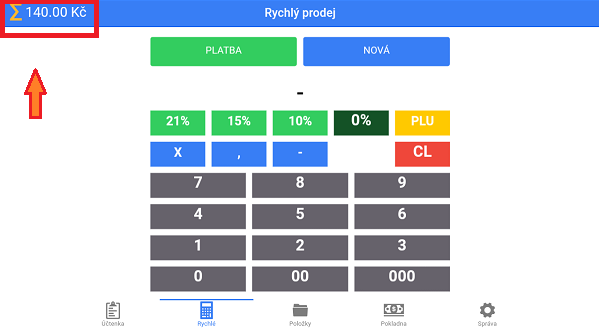

#Suma

Suma je finanční součet všech položek na právě označené účtence, zobrazující v horní části sekcí **Účtenka**, **Rychlé**, **Položky**.

*obrázek: Suma označené účtenky, jejíž hodnota je 140 kč*
