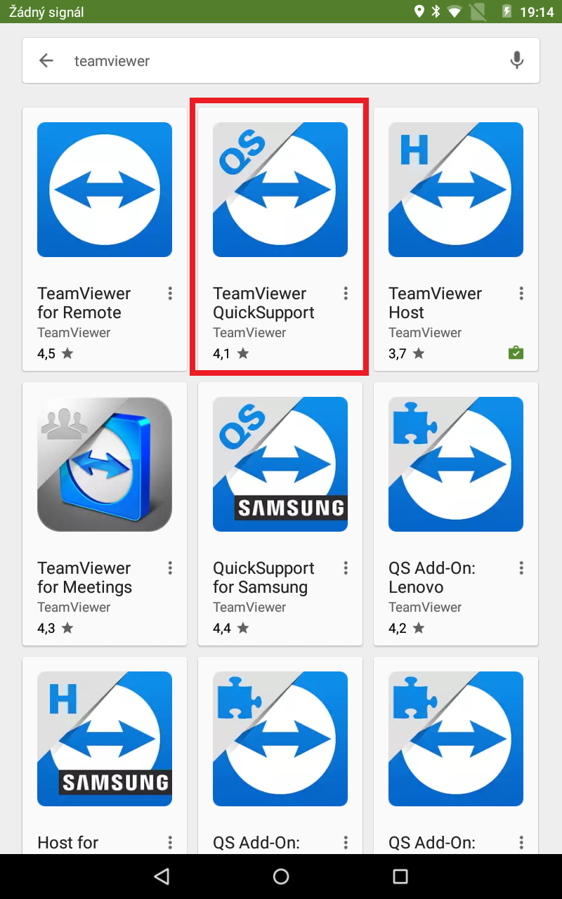
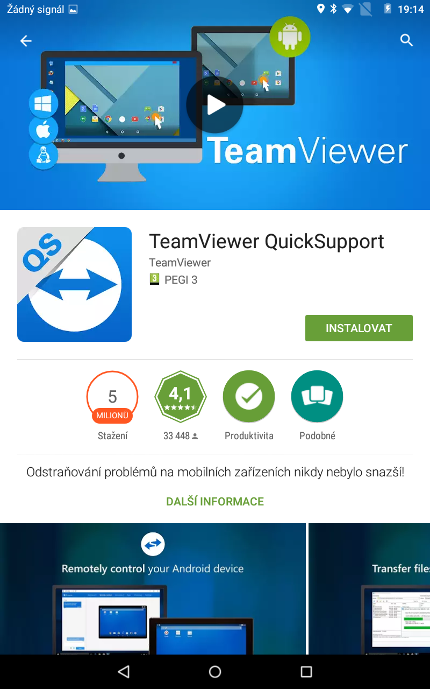
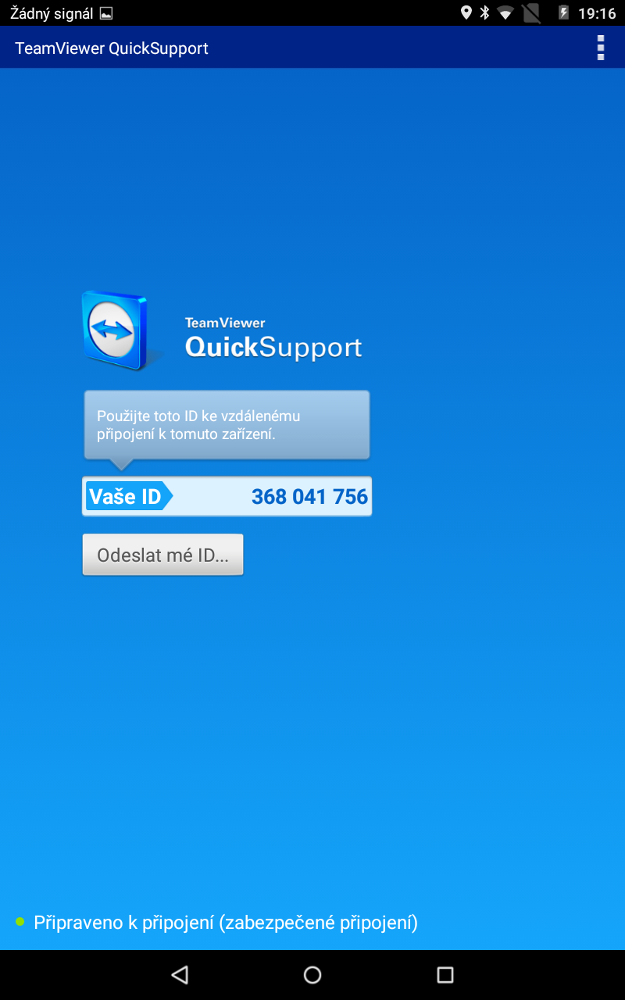
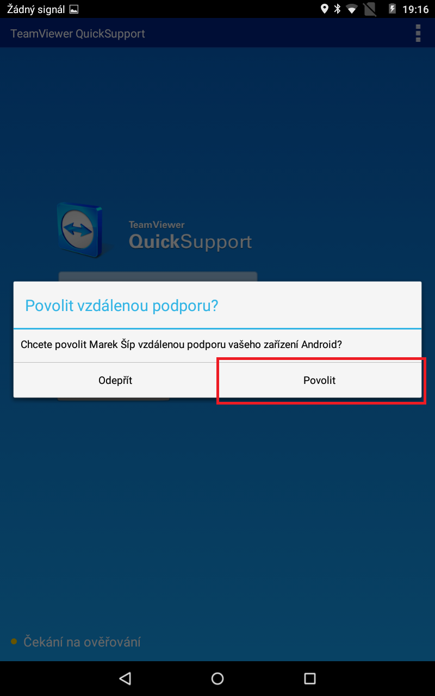

#Vzdálená správa (Android)

1) V aplikaci Google Play vyhledejte **TeamViewer** a vyberte aplikaci **TeamViewer QuickSupport**
 

    

         
    

2) Instalujte program vzdálené správy tlačítkem **INSTALOVAT**

    

         
    

3) Sdělte podpoře ArrowSys **Vaše ID**

    

         
    

4) Povolte připojení ke Vzdálené správě tlačítkem **Povolit**

    

         
    

