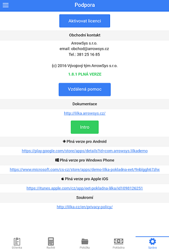
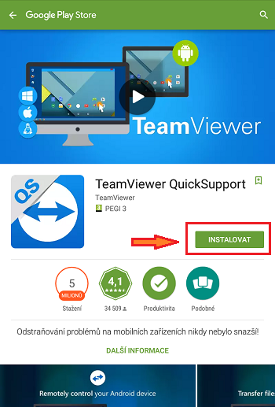
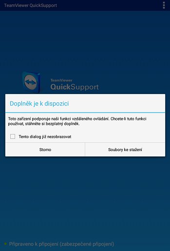
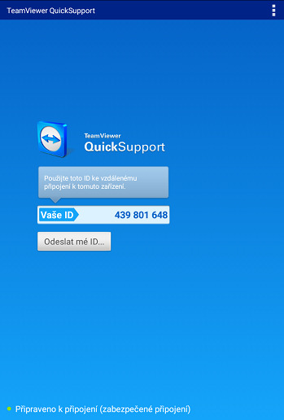
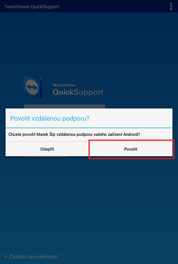

#Vzdálená pomoc (Android)

1. Otevřete **Správa > Podpora** a klikněte na tlačítko **Vzdálená pomoc**

    

2. Po zobrazení aplikace **[TeamViewer QuickSupport](https://play.google.com/store/apps/details?id=com.teamviewer.quicksupport.market&hl=cs)** v **Google Play** aplikaci TeamViewer QuickSupport nainstalujte kliknutím na tlačítko **INSTALOVAT**

    

   Pro plnou funkčnost aplikace prosím potvrďte instalaci potřebných doplňků
   
    
   
3. Po instalaci se otevře aplikace TeamViewer QuickSupport, kde bude vypsán Váš **ID kód**

    

4. Nyní kontaktujte zákaznickou podporu Arrowsys na čísle **381 251 685** a sdělte váš problém a **ID kód** Vašeho zařízení

5. Povolte připojení ke Vzdálené správě tlačítkem **Povolit**

    
